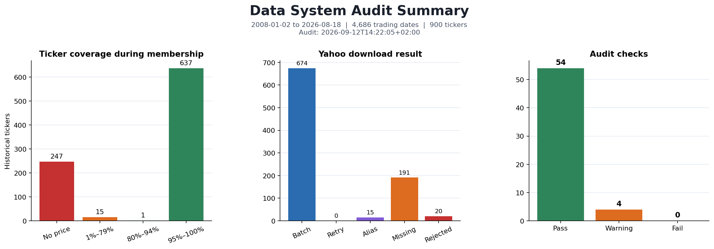
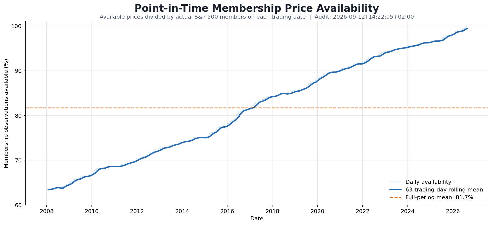

# Cross-Sectional Equity Factor Research

## Work in Progress

This project is currently under active development. The Data System is completed. The revised Factor Layer and Factor Selection Layer code are ready for their first complete run.

## Research Objective

The purpose of this project is to study whether information contained in historical stock prices can identify differences in future returns across S&P500 companies.

The project does not attempt to forecast the direction of the complete stock market. It performs cross-sectional research: on every observation date, stocks are compared with other stocks available in the index universe at that time.

The research begins with interpretable price-based factors. Different factor definitions, parameter settings and return horizons are tested across multiple historical periods. Their statistical and economic results are then compared to determine whether any signal is sufficiently stable for further research.

The current objective is factor discovery and evaluation. A production trading strategy or final portfolio construction model is not assumed before the factors demonstrate useful out-of-sample behaviour.

## Project Roadmap

| stage                  | status            |
|------------------------|-------------------|
| Data System            | **completed**            |
| Factor Layer           | rebuild required         |
| Factor Selection Layer | code ready, not run      |
| Research Layer         | partially ready          |

## Project Structure
src/

  - Data_System/
    - __init__.py
    - config.py
    - risk_free_rate.py
    - get_tickers.py
    - data_quality.py
    - equity_data.py
    - data_audit.py
    - **pipeline.py**
    - delete.py

  - Factors_Layer/
    - factor_config.py
    - factors.py
    - transforms.py
    - factor_builder.py
    - forward_returns.py
    - factor_storage.py
    - **pipeline.py**
    - delete.py

  - Factor_Selection_Layer/
    - selection_config.py
    - selection_storage.py
    - quantile_analysis.py
    - ic_analysis.py
    - robustness.py
    - **pipeline.py**

  - Research_Layer/
    - research_config.py
    - legacy_factor_pipeline.py
    - research.py
    - candidate_research.py
    - walk_forward.py
    - statistical_research.py
    - factor_independence.py
    - quantile_research.py
    - regime_research.py
    - composite_alpha_research.py
    - market_opportunity_research.py
    - portfolio_implementation_research.py
    - trend_slope_conditional_research.py

  - Pipeline
    - run.py

Data/

  - Data_System/
    - Raw/
    - Processed/
    - Cache/

  - Factors_Layer/
    - Cache/
      - Factor_Matrices/
      - Forward_Return_Matrices/

  - Factor_Selection_Layer/
    - Cache/
      - daily_quantile_results.parquet

  - Research_Layer/
    - Cache/
    - Legacy/

Results/

  - Data_System/
    - Figures/
    - data_audit_report.md

  - Factors_Layer/
    - Figures/
    - factor_run_metadata.json

  - Factor_Selection_Layer/
    - Figures/
    - quantile_run_metadata.json

  - Research_Layer/
    - Figures/

`Data` contains large datasets, calculated matrices and disposable caches. It is excluded from Git because every current file can be downloaded or calculated again.

`Results` contains compact tables, run metadata, audit reports and figures intended for direct reading and Git history.

## Data System [1]

The purpose of this layer is to create the complete data foundation used by the Factor Layer. It downloads the historical S&P500 ticker universe, obtains available Yahoo Finance market data, reconstructs point-in-time index membership and prepares aligned research matrices.

Equity market data are downloaded from 2008. This provides historical observations that can later be used as factor warm-up data. The Data System itself does not select factor-research periods or divide observations into research and validation windows.

The completed layer creates 12 core equity datasets with different metrics and formats:
- Seven **"Processed"** files.
- Five **"Raw"** files.
- One additional macro dataset containing the US three-month Treasury rate.

The final output contains adjusted prices, returns, compatible volume, liquidity, historical index membership, price and volume quality, price availability, long-format prices and 21-day forward returns. All wide matrices use aligned trading dates and historical ticker columns.

Every completed Data System bundle is checked by a separate read-only audit. The audit verifies file readability, matrix alignment, calculated relationships, historical-universe construction, price gaps, volume quality and risk-free-rate coverage. Its results are written to a separate Markdown report and do not automatically change the datasets.

**Limitations**:
- Historical membership is taken from a community-maintained GitHub repository, not from official S&P data.
- yfinance may have missing or incomplete history for delisted stocks and old ticker symbols. Therefore survivorship bias is reduced but not fully removed.
- All Factor Layer results must be interpreted with this remaining survivorship/data-availability bias in mind.
- The dataset ends on the latest repository snapshot instead of assuming an unknown index composition after that date.

IMPORTANT:
- All future features must be computed using data up to t-1
- daily returns represent t-1 -> t
- saved forward returns represent t -> t+21 trading days

### **config.py**:
- Defines separate paths for heavy Data System files in `Data/Data_System` and readable outputs in `Results/Data_System`.
- Stores raw datasets in `Data/Data_System/Raw`, processed matrices in `Data/Data_System/Processed` and the yfinance cache in `Data/Data_System/Cache`.
- Stores the audit report in `Results/Data_System` and audit figures in `Results/Data_System/Figures`.
- Defines the historical S&P500 components URL and the FRED DGS3MO URL.
- `DATA_START_DATE = 2008-01-01`.
- Price-quality parameters:
  - `SUSPICIOUS_ABS_DAILY_RETURN = 0.5`.
  - `MAX_ABS_DAILY_RETURN = 1.0`.
  - `ROUND_TRIP_RETURN_TOLERANCE = 0.25`.
- Audit parameters:
  - `AUDIT_NUMERIC_TOLERANCE = 1e-10`.
  - `AUDIT_FILE_TIME_SPREAD_HOURS = 6`.
  - `AUDIT_VOLUME_JUMP_RATIO = 100`.
- `CONFIRMED_REAL_RETURN_EVENTS` contains manually verified extreme market moves. Currently: `HIG` on `2008-12-05`, `GME` on `2021-01-27` and `NKTR` on `2025-06-24`.
- `YAHOO_REUSED_TICKERS` contains obsolete symbols whose Yahoo history belongs to another security. These symbols are rejected when no verified continuous alias exists.
- `YAHOO_TICKER_ALIASES` contains only verified direct company/ticker changes. Acquisitions, unrelated mergers and post-bankruptcy securities are not treated as continuous aliases.

### **risk_free_rate.py**
- Prepares the daily three-month US Treasury yield used as the project risk-free-rate dataset.
- Uses the official FRED `DGS3MO` series and stores annual yield in percent.

#### download_dgs3mo
- Downloads DGS3MO observations for the requested start and end dates without an API key.
- Requires exactly two columns from FRED and renames them to `date` and `annual_rate_pct`.
- Parses dates and converts rate observations to numeric values.
- Keeps unavailable rate observations as missing.
- Sorts observations and limits them to the requested period.
- Requires at least 100 valid rate observations.
- Rejects duplicated dates and negative rates.
- Returns the prepared rate DataFrame without saving it.

#### prepare_risk_free_rate
- Used by the main Data System pipeline.
- Keeps the existing `Data/Data_System/Raw/dgs3mo.parquet` without downloading it again.
- Calls `download_dgs3mo` only when the local file does not exist.
- Creates the destination directory and saves the downloaded rate dataset.
- Does not inspect or extend an existing file; its quality and coverage are checked later by `data_audit.py`.

#### ensure_risk_free_rate
- Used when another research module directly requires a rate dataset for a specific period.
- Loads the existing file when forced downloading is disabled.
- Checks whether valid local observations cover the requested start and end dates.
- Returns the requested slice when local coverage is sufficient.
- Downloads and overwrites the rate dataset when the file is missing, coverage is insufficient or `force_download=True`.

### **get_tickers.py**:
- Prepares the historical S&P500 universe and point-in-time membership.
- Uses the community-maintained `fja05680/sp500` GitHub repository.

#### normalize_ticker
- Removes surrounding spaces and converts the ticker to uppercase.
- Replaces dots with dashes for yfinance compatibility.

#### get_sp500_history
- Downloads `S&P 500 Historical Components & Changes (Updated).csv` when `refresh=True`.
- Saves the downloaded source file in `Data/Data_System/Raw`.
- Uses the local copy when the online request fails.
- Raises the original download error when both the online source and local copy are unavailable.
- Requires `date` and `tickers` columns.
- Keeps only these two required columns.
- Parses and sorts snapshot dates.
- Keeps the last snapshot when the source contains the same date more than once.
- Normalizes every ticker inside every snapshot.
- Requires historical snapshots covering `DATA_START_DATE` or later.
- Requires between 450 and 550 components in every relevant snapshot.
- Rejects duplicated tickers inside one snapshot.
- Returns the prepared historical snapshots DataFrame.

#### get_sp500_tickers
- Loads historical snapshots when they were not provided by the caller.
- Starts with the latest snapshot available on or before the requested start date.
- Raises an error when the requested start date is earlier than the available history.
- Combines tickers from every relevant snapshot into one historical ticker union.
- Removes duplicated ticker symbols and returns the sorted list.

#### get_sp500_tickers_by_date
- Loads historical snapshots when they were not provided by the caller.
- Finds the latest index snapshot available on or before the requested date.
- Returns the S&P500 component list from that snapshot.
- Raises an error when the requested date is earlier than the available history.

#### build_membership_matrix
- Receives historical snapshots, equity trading dates and the complete ticker list.
- Creates one boolean snapshot row for every historical component date.
- Reindexes snapshots to the equity trading calendar.
- Carries each snapshot forward until the next index change.
- Uses `True` when a ticker belongs to the index and `False` when it does not.
- Raises an error when membership history does not cover the first equity trading date.
- Warns when trading dates extend beyond the latest available historical snapshot.
- Returns the daily boolean membership matrix.

### **data_quality.py**
- Contains price- and volume-quality functions used by `equity_data.py`.
- Does not download, save or change datasets by itself.

#### build_volume_quality_mask
- Receives the compatible-volume matrix.
- Creates a boolean matrix with the same dates and tickers.
- Returns `True` only when volume exists, is finite and is greater than zero.
- Returns `False` for missing, zero, negative and infinite volume.
- This mask is applied before liquidity is calculated.

#### build_confirmed_event_mask
- Receives prices and the manually verified extreme market events from `config.py`.
- Creates a boolean matrix filled with `False`.
- Marks `True` only on the ticker-date pairs listed in `CONFIRMED_REAL_RETURN_EVENTS`.
- Allows known real extreme moves to remain usable instead of being treated as data errors.

#### build_data_quality_mask
- Receives the adjusted-price matrix and price-quality thresholds from `config.py`.
- Requires observed prices to be positive.
- Calculates raw daily returns without filling missing prices.
- Flags returns with an absolute move of at least 50% as suspicious diagnostics.
- Flags returns with an absolute move of at least 100% as extreme.
- Detects possible one-day spike reversals: a large move followed by a large opposite move that approximately returns to the original price.
- Removes manually confirmed real extreme events from the anomaly list.
- Creates an anomaly trigger from unconfirmed extreme returns or spike reversals.
- Quarantines a ticker from its first anomaly trigger onward.
- Returns four boolean matrices: price quality, suspicious returns, anomaly triggers and quarantine state.

#### first_true_date
- Receives a boolean matrix such as the quarantine matrix.
- Finds the first date with `True` for every ticker.
- Returns `NaT` when a ticker never has a `True` observation.
- Used by `equity_data.py` to store `quarantined_from` in `universe.csv`.

### **equity_data.py**:
- Downloads, calculates, aligns and saves the complete equity dataset for further factor analysis.

#### download_yahoo_request
- Sends one yfinance request for the provided tickers and start date.
- Uses `auto_adjust=False` to receive both raw close and adjusted close.
- Returns an empty DataFrame when Yahoo returns nothing or the request fails.

#### Download helpers
- `ticker_has_prices` checks whether a ticker has at least one adjusted close observation.
- `select_ticker_data` selects one Yahoo ticker and renames it to the required historical ticker.
- `merge_downloads` combines additional observations without overwriting existing non-missing data.
- `replace_ticker_data` removes the existing ticker series before inserting its verified replacement.

#### download_data
- Downloads the historical ticker union from `DATA_START_DATE` in batches of 50.
- Uses the local yfinance timezone and cookie cache.
- Merges batches and removes duplicated columns.
- Retries individually only tickers with no adjusted price observations after batch downloading.
- Uses explicit aliases only for verified direct ticker changes.
- Replaces the old ticker series with the verified alias series.
- Rejects every ticker from `YAHOO_REUSED_TICKERS` when no verified continuous alias exists.
- Keeps unavailable and rejected historical tickers in the universe but without false price data.
- Records `batch`, `individual_retry`, `alias`, `missing` or `reused_symbol_rejected` for every ticker.
- Raises an error only when Yahoo returns no usable price data for the entire ticker universe.

#### get_price_matrix
- Extracts adjusted close prices.
- Sorts observations by date.
- Removes dates where every ticker is missing.
- Keeps individual missing prices as missing.

#### get_volume_matrix
- Extracts raw Yahoo volume.
- Extracts raw close and adjusted close.
- Rescales volume by `raw close / adjusted close`.
- Keeps `adjusted price x stored volume` equal to `raw close x raw Yahoo volume`.
- Replaces negative volume with missing values.
- Does not replace zero volume at that step.

#### compute_returns
- Computes daily return from `t-1` to `t` using adjusted prices.
- Does not clip large real market moves.
- Requires both the current and previous price to pass data quality.
- Replaces a return with missing when either endpoint failed data quality.

#### compute_liquidity
- Receives volume after the `volume_quality` mask has been applied.
- Computes daily dollar volume as `adjusted price x compatible volume`.
- Calculates the 20-day rolling mean of dollar volume.
- Requires 20 valid observations in the rolling window.
- Applies the `log(1 + x)` transform.

#### to_long
- Converts the wide adjusted-price matrix into `date`, `ticker`, `price` rows.
- Stores only observed prices.

#### compute_forward_returns
- Uses 21 trading days as the default horizon.
- Calculates `price[t+21] / price[t] - 1` without a forecasting model.
- Requires both the starting and ending price to pass data quality.
- Keeps unavailable forward returns as missing.

#### compute_availability
- Creates the final price availability matrix.
- An observation is available only when price exists, the ticker is an index member and price quality is valid.
- Does not include volume quality in price availability.

#### sanity_checks
- Checks that the price index is sorted.
- Checks that the dataset contains more than 100 ticker columns.
- Checks price and volume index and column alignment.
- Raises an error for negative volume.
- Raises an error for duplicated dates.
- Prints the average missing-value ratio for volume.

#### filter_universe
- Counts available S&P500 members for every date.
- Removes dates with fewer than 150 available members.
- Initially filters prices, liquidity, membership and price quality.
- Returns, forward returns, volume and volume quality are aligned to the retained dates afterwards.
- Does not remove individual tickers using full-period coverage.

#### save_all
- Saves adjusted prices, compatible volume and liquidity in `Data/Data_System/Raw`.
- Saves returns, forward returns, long prices, membership, data quality, volume quality and availability in `Data/Data_System/Processed`.
- Saves the universe report as `Data/Data_System/Raw/universe.csv`.
- Writes every dataset directly to its configured parquet or csv path.

#### load_saved_equity_data
- Loads prices, returns, volume, liquidity, long prices, availability and forward returns.
- Returns these seven datasets to `pipeline.py` in a fixed order.

#### build_and_save_dataset
- Runs the complete equity data-building sequence.
- Downloads data and creates the download report.
- Creates price and compatible-volume matrices with every historical ticker column.
- Limits prices and volume to the latest membership snapshot date.
- Builds point-in-time membership using `get_tickers.py`.
- Aligns volume to prices and keeps volume only where price exists.
- Calls `data_quality.py` to identify suspicious returns, anomaly triggers and ticker quarantine dates.
- Uses full-period coverage and anomaly statistics only for the universe diagnostic report.
- Creates returns and 21-day forward returns using price quality.
- Creates `volume_quality`, excludes invalid volume from liquidity input and computes liquidity.
- Removes dates with fewer than 150 available index members.
- Aligns all output matrices to the retained dates.
- Creates availability and long-format prices.
- Runs sanity checks.
- Saves all equity datasets and the universe report.
- Returns prices, returns, volume, liquidity, long prices, availability and forward returns.

### **data_audit.py**
- Runs a read-only audit of all Data System datasets.
- Does not download, delete or correct market data.

#### add_check
- Adds one `PASS`, `WARNING` or `FAIL` result to the common checks list.
- Stores the section, check name, status and result details.

#### normalize_ticker
- Converts a ticker to text, removes surrounding spaces and converts it to uppercase.
- Replaces dots with dashes to match the Data System ticker format.

#### normalize_history
- Keeps only `date` and `tickers` from the historical components file.
- Parses and sorts dates and keeps the last snapshot when a date is duplicated.
- Applies ticker normalization to every historical snapshot.

#### frame_is_aligned
- Checks whether another matrix has exactly the same dates and ticker columns as the reference matrix.

#### numeric_mismatch_count
- Compares two numeric matrices using `AUDIT_NUMERIC_TOLERANCE`.
- Treats missing values in the same positions as equal.
- Returns the number of cells that do not match.

#### build_bundle_fingerprint
- Reads the file name, size and modification time of every expected dataset.
- Includes missing-file states.
- Creates one SHA-256 fingerprint for the complete Data System bundle.

#### load_files
- Checks whether every required parquet and csv file exists.
- Records file path, state, size and modification time for the report inventory.
- Opens every available file and reports unreadable or missing files as `FAIL`.
- Returns all successfully loaded datasets to the remaining audit checks.

#### check_file_generation_times
- Compares modification times of all equity files except the risk-free-rate file.
- Returns `WARNING` when some equity files are missing.
- Returns `WARNING` when the modification-time spread exceeds `AUDIT_FILE_TIME_SPREAD_HOURS`.

#### check_wide_matrices
- Checks that the price index contains unique sorted dates.
- Checks that price ticker columns are unique.
- Rejects non-positive and infinite observed prices.
- Checks that returns, volume, volume quality, liquidity, availability, forward returns, membership and price quality are aligned with prices.

#### check_boolean_matrices
- Checks that availability, membership, price quality and volume quality contain boolean columns.
- Checks that price quality cannot be `True` where a positive observed price does not exist.

#### check_calculated_matrices
- Recalculates daily returns from prices and price quality and compares every cell with the saved matrix.
- Confirms that large returns were not clipped and no unconfirmed return of at least 100% remains usable.
- Recalculates 21-day forward returns and compares them with the saved matrix.
- Recalculates availability as `price exists AND membership AND price quality`.
- Recalculates liquidity from prices and volume after applying volume quality.

#### longest_true_run
- Calculates the longest consecutive `True` sequence in one boolean series.
- Currently remains as a helper but is not called by the audit workflow.

#### find_true_runs
- Finds every consecutive `True` sequence with at least the requested length.
- Returns the start date, end date and length of every sequence.
- Used to find long missing-price and invalid-volume runs.

#### check_price_gaps
- Finds consecutive missing-price observations during actual index membership.
- Reports `WARNING` when a price gap is longer than 5 trading dates.
- Reports the number of runs, affected observations and affected tickers.
- Shows the ticker, length, start date and end date of the 10 longest gaps.
- Does not fill, remove or correct these gaps.

#### check_volume
- Rejects negative and infinite volume values.
- Confirms that volume quality is `True` only for observed, finite and positive volume.
- Counts missing and zero volume during actual index membership.
- Confirms that every invalid raw volume observation is excluded by volume quality.
- Reports positive-to-positive volume changes of at least `AUDIT_VOLUME_JUMP_RATIO`.
- Reports runs of at least 5 missing or zero-volume observations.
- Confirms that invalid volume is excluded from liquidity while the price observation remains available.

#### check_prices_long
- Requires `date`, `ticker` and `price` columns in the long prices dataset.
- Checks row count and duplicated date-ticker pairs.
- Recreates long prices from the wide price matrix and compares all keys and values.

#### historical_ticker_union
- Recreates the complete historical ticker union beginning with the latest snapshot available on or before `DATA_START_DATE`.

#### build_expected_membership
- Recreates the daily membership matrix directly from historical component snapshots.
- Carries every snapshot forward until the next snapshot.
- Uses missing membership as `False`.

#### check_history_and_universe
- Validates historical component columns, dates, component counts and unique snapshots.
- Recreates membership and compares it with the saved membership matrix.
- Confirms that price data does not extend beyond the latest membership snapshot.
- Validates the columns and coverage values in `universe.csv`.
- Confirms that universe, prices and historical ticker union contain the same ticker set.
- Reports tickers without membership-period prices, coverage below 80%, missing downloads and rejected reused symbols.
- Confirms that membership counts in `universe.csv` match the membership matrix.

#### check_risk_free_rate
- Requires the `annual_rate_pct` column.
- Checks sorted unique dates, missing values, negative values and infinite values.
- Confirms that valid DGS3MO observations cover the equity data period with a seven-day boundary tolerance.

#### overall_status
- Returns `FAIL` when at least one check failed.
- Otherwise returns `WARNING` when at least one warning exists.
- Returns `PASS` only when every check passed.

#### run_check_group
- Runs one group of audit checks.
- Converts an unexpected exception inside a check group into a visible `FAIL` instead of stopping the complete audit.

#### markdown_escape
- Escapes table separators and line breaks before values are inserted into the Markdown report.

#### render_report
- Creates the main numbered checks table and file inventory.
- Adds the bundle fingerprint, total status and status counts.
- Adds interpretation rules and limitations of the audit.

#### render_summary_image
- Creates `Results/Data_System/Figures/data_audit_summary.png` from the datasets and completed audit checks.
- Shows ticker coverage during membership, Yahoo download results and audit status counts.
- Uses the same loaded data and checks as the Markdown audit report.
- Atomically replaces the previous image on every audit run.

#### render_availability_timeline
- Creates `Results/Data_System/Figures/membership_availability_timeline.png` from membership and availability.
- Calculates the percentage of actual index members with an available price on every trading date.
- Shows the daily percentage, its 63-trading-day rolling mean and the full-period mean.
- Uses a 60% to 100% vertical scale to keep the observed historical changes readable.
- Atomically replaces the previous image on every audit run.

#### write_report
- Writes the report to a temporary file in the Reports directory.
- Atomically replaces the previous `Results/Data_System/data_audit_report.md` after writing succeeds.

#### run_data_audit
- Builds the expected file list, timestamp and bundle fingerprint.
- Loads all datasets.
- Runs file, matrix, calculation, universe, price-gap, volume and risk-free-rate check groups.
- Creates and writes the final Markdown report, PNG summary and availability timeline.
- Prints the overall status and report path.
- Returns the overall status and all individual check results.
- Runs independently or automatically at the end of `pipeline.py`.

### **pipeline.py**
- Orchestrates the complete Data System workflow.
- Does not contain downloading, cleaning or audit logic itself.

#### EQUITY_REQUIRED_PATHS
- Lists every file required for a complete equity dataset.
- Includes raw prices, all processed matrices, the universe report and historical membership source.
- Does not include the risk-free-rate file because it is prepared separately.

#### prepare_equity_data
- Checks whether every file in `EQUITY_REQUIRED_PATHS` exists.
- Loads the saved equity datasets when the complete bundle exists.
- Rebuilds the complete equity bundle when at least one required file is missing.
- During a rebuild, loads historical S&P500 snapshots and creates the historical ticker union.
- Passes historical snapshots and tickers to `equity_data.py` for downloading, processing and saving.
- Does not rebuild only one missing equity file; it rebuilds the complete equity bundle to keep all matrices aligned.

#### run_pipeline
- Starts the complete Data System process.
- Calls `prepare_equity_data` to load or rebuild the equity bundle.
- Uses the first returned dataset, adjusted prices, to determine the equity end date.
- Calls `prepare_risk_free_rate` for the period from `DATA_START_DATE` to the final equity date.
- Runs `data_audit.py` after all datasets are available.
- Prints that the Data System is ready and returns the loaded equity datasets.

#### print_summary
- Receives the seven returned equity datasets.
- Prints DataFrame information for prices, returns, volume, liquidity, long prices, availability and forward returns.
- Does not change or save data.

### **delete.py**:
- Deletes all generated Data System datasets, including the risk-free rate.
- Deletes the generated audit report and both audit figures from `Results/Data_System`.
- It could be useful to clean space for further data updating.

## Data System Result

**Build snapshot**:
- Equity period: `2008-01-02` to `2026-08-18`.
- Trading dates retained: `4,686`.
- Historical ticker union: `900` tickers.
- Historical component snapshots: `2,720`.
- Final wide-matrix shape: `4,686 dates x 900 tickers`.
- Long-format adjusted prices: `2,827,310` observations.

**Price availability**:
- Point-in-time membership observations: `2,350,698`.
- Available price observations during membership: `1,921,650` (`81.75%`).
- Missing or unavailable price observations during membership: `429,048` (`18.25%`).
- Tickers without any price during their membership period: `247`.
- Tickers with membership-period price coverage below 80%: `262`.
- Yahoo tickers still reported as missing: `191`.
- Reused Yahoo symbols rejected to prevent another security from entering the dataset: `20`.
- No ticker is removed from the historical universe because of missing prices; unavailable ticker-date observations remain unavailable.

**Quality effects**:
- Price quality does not clip valid large returns.
- The saved return matrix contains `92` absolute daily returns of at least 50% and no usable unconfirmed return of at least 100%.
- `33` missing or zero-volume observations during membership are rejected by `volume_quality` and excluded only from liquidity calculations.
- `36` positive-to-positive volume changes of at least 100x remain as warnings because both observations are valid positive values.
- The audit reports `277` missing-price runs longer than 5 trading dates, containing `429,023` observations across `263` tickers.

**Audit result**:
- Overall status: **WARNING**.
- Checks: `54 PASS / 4 WARNING / 0 FAIL`.
- Every required dataset opens successfully.
- All saved wide matrices are aligned and all audited calculated relationships reproduce from their source matrices.
- The risk-free-rate dataset covers the complete equity period.

**Conclusion**:

The Data System produces a structurally consistent point-in-time dataset that is ready to be consumed by the Factor Layer. No failed internal checks remain. The main unresolved limitation is historical price availability from Yahoo Finance: missing and rejected old ticker histories reduce usable membership observations and leave residual survivorship/data-availability bias in all later factor results.

## Factor Layer [2]

The purpose of this layer is to calculate reusable factor inputs. It creates 56 factor-score matrices and eight forward-return matrices. It does not calculate IC, choose factor winners, divide history into robustness periods or evaluate a trading strategy.

The Factor Layer receives completed Data System matrices from 2008. Early observations provide warm-up history for long factor windows. Research evaluation begins only in Layer 3, where dates from 2010 are marked as eligible.

Heavy matrices and factor metadata are stored in `Data/Factors_Layer/Cache`. Compact run metadata are stored in `Results/Factors_Layer`.

### factor_config.py
- Defines every Factor Layer data, cache and result path.
- Stores factor matrices in `Factor_Matrices` and forward-return matrices in `Forward_Return_Matrices`.
- Requires 80% of observations inside every effective factor window.
- Keeps winsorization settings available but leaves winsorization disabled.
- Defines eight forward-return horizons: 1, 5, 10, 21, 42, 63, 126 and 252 trading days.
- Contains 56 fixed parameter configurations across 11 factor families.
- Does not contain signal lag, minimum cross-sectional asset count or robustness periods because those settings belong to Layer 3.

### factors.py
- Contains only the calculation logic for every baseline and candidate factor.
- Uses one public `compute_...` function for every factor family.
- Does not contain parameter grids, research periods, IC calculation, file paths or factor selection.
- Receives every window and calculation setting explicitly from `factor_builder.py`.

### Baseline factors

**Momentum**
- Measures previous cumulative return.
- _Different windows and skipped recent periods are defined in `factor_config.py`._

**Low Volatility**
- Measures historical return volatility.
- Lower volatility is better, so factor sign is negative.

**Trend**
- Price / SMA - 1.
- Measures how far price is from moving average.

### Candidate factors
- Short-Term Reversal
- Residual Momentum
- Volatility-Scaled Momentum
- High Proximity
- Trend Slope
- Risk-Adjusted Trend
- Liquidity Change
- Price-Volume Confirmation

### transforms.py
- `winsorize` optionally limits extreme cross-sectional factor values at configured percentiles.
- `zscore` converts every available stock value into standard deviations from the same-date cross-sectional mean.
- `prepare_factor` applies point-in-time availability, optional winsorization and cross-sectional normalization in that order.
- `percentile_rank` converts factor scores into same-date percentile ranks when a later layer requires ranks.
- Winsorization is currently disabled, so real factor-score extremes remain in the matrices.

### factor_builder.py

#### required_observations
- Converts a factor window into its minimum valid-observation requirement.
- Uses the common 80% rule from `factor_config.py`.

#### configuration_parameters
- Removes the human-readable variant name from one configuration.
- Keeps only the numerical settings that produced the matrix.

#### factor_key
- Creates one unique `family|variant` identifier for every factor matrix.

#### prepare_raw_factor
- Sends a raw factor through the common availability and cross-sectional transformation sequence.

#### build_factor_scores
- Selects the correct formula from `factors.py` for one family and one configuration.
- Passes prices, returns or quality-adjusted volume only when that formula needs them.
- Returns one complete normalized date-by-ticker factor-score matrix.

#### build_factor_matrices
- Calculates all 56 configured factor-score matrices.
- Saves every matrix independently through `factor_storage.py`.
- Creates one 56-row metadata table containing key, family, variant, parameters and file path.
- Rejects missing or duplicated factor configurations.

### forward_returns.py

#### compute_forward_returns
- Calculates `price[t+h] / price[t] - 1` for one configured horizon without a forecasting model.
- Requires both the starting and ending adjusted prices to pass Data System price quality.
- Keeps unavailable results as missing values.

#### build_forward_return_matrices
- Calculates one complete date-by-ticker matrix for each of the eight horizons.
- Saves the eight matrices independently through `factor_storage.py`.
- Does not rank returns or combine them with a factor.

### factor_storage.py
- `prepare_factor_directories` creates the Factor Layer data, matrix, result and figure directories.
- `load_factor_inputs` loads and aligns prices, returns, volume, availability, membership, price quality and volume quality from the Data System.
- `load_factor_inputs` checks that availability still equals observed price, membership and price quality.
- Invalid volume is removed before it reaches liquidity-based factors.
- File-name helpers create stable paths for all 56 factor matrices and all eight forward-return matrices.
- Atomic saving helpers write Parquet, CSV and JSON through temporary files before replacement.
- Cache-fingerprint helpers combine Data System file states, factor source-code hashes and every Layer 2 calculation setting.
- `factor_cache_is_valid` requires all 64 matrices, a valid 56-row factor metadata file and a matching cache manifest.
- Save and load functions store matrices as `float32`, factor metadata as CSV and run metadata as JSON.

### **pipeline.py**
- Orchestrates the complete Factor Layer workflow.
- Creates the required storage directories and loads completed Data System matrices.
- Reuses the complete cache only when its files and fingerprint match current data, code and configuration.
- Calls `factor_builder.py` and `forward_returns.py` when the cache must be rebuilt.
- Saves factor metadata, the cache manifest and compact run metadata.
- Prints whether the cache was reused and confirms 56 factor-score plus eight forward-return matrices.
- Does not calculate IC, robustness windows, quantile returns or factor selection.

### delete.py
- Deletes every generated file inside `Data/Factors_Layer` and `Results/Factors_Layer`.
- Includes factor matrices, forward-return matrices, metadata, cache manifest and run metadata.
- Does not delete Data System or Research Layer files.
- Validates that both deletion targets are inside the current project before deleting anything.

IMPORTANT:
- A Factor Layer matrix stores normalized factor scores, not factor ranks, IC or predicted returns.
- A forward-return matrix stores the realised return beginning on its row date for one horizon.
- Factor signal lag and membership at the trade date are applied only when Layer 3 combines these independent matrices.
- This layer prepares hypotheses. It does not judge whether any hypothesis works.

## Factor Selection Layer [3]

The purpose of this layer is to combine the 56 factor-score matrices with the eight forward-return matrices and create economically interpretable daily cross-sectional results. It does not recalculate factor formulas.

The current primary output is `daily_quantile_results.parquet`. One row represents one trading date and one factor-horizon hypothesis. With 4,686 current dates and 448 hypotheses, the complete file contains approximately 2.1 million rows.

The file keeps warm-up dates from 2008 so later analysis can select periods without rebuilding it. `research_eligible` marks observations from 2010 onward; those are the dates intended for research conclusions.

### selection_config.py
- Defines paths to Factor Layer matrices, membership and Layer 3 outputs.
- Uses the same eight return horizons produced by Layer 2.
- Uses `SIGNAL_LAG = 1`, five quantiles and at least 30 valid factor-return pairs per date.
- Marks research dates from `2010-01-01`; earlier rows remain warm-up data.
- Keeps the short and long period definitions required only by optional robustness analysis.

### selection_storage.py

#### prepare_selection_directories
- Creates Layer 3 Data, Cache, Results and Figures directories.

#### safe_factor_name
- Converts a factor family and variant into the same safe file name used by Layer 2.

#### factor_matrix_path
- Returns the expected path of one stored factor-score matrix.

#### forward_return_matrix_path
- Returns the expected path of one stored forward-return matrix.

#### load_factor_metadata
- Loads the Factor Layer metadata table.
- Requires 56 unique factor definitions and all identity columns.

#### load_membership
- Loads point-in-time membership from the Data System.
- Requires unique sorted dates and unique ticker columns.

#### validate_matrix_axes
- Rejects a factor or forward-return matrix when its dates or tickers differ from membership.

#### load_factor_matrix
- Reads and validates one factor matrix at a time to limit memory use.

#### load_forward_return_matrices
- Loads the eight reusable return matrices once per run.
- Validates every matrix against membership before analysis begins.

#### temporary_path
- Creates the temporary file name used for atomic output replacement.

#### save_json
- Writes run metadata to a temporary file before replacing the previous JSON.

#### save_parquet_chunks
- Writes result chunks directly to one temporary compressed Parquet file.
- Removes the incomplete temporary file when any chunk fails.
- Replaces the previous result only after every chunk succeeds.
- Returns the written row and chunk counts for final validation.

### quantile_analysis.py

#### prepare_factor_quantiles
- Shifts one factor matrix by one trading day.
- Keeps only stocks that are index members on the new trade date.
- Ranks the available factor scores cross-sectionally on every date.
- Assigns each stock to Q1, Q2, Q3, Q4 or Q5 without using its future return.

#### aggregate_quantile_returns
- Combines the already assigned quantiles with realised returns for one horizon.
- Calculates the stock count and equal-weighted mean return inside every daily quantile.
- Keeps counts but marks returns missing when fewer than 30 valid stocks exist across the date.

#### research_date_mask
- Marks dates from 2010 through the configured research end as eligible for conclusions.
- Does not delete the 2008-2009 warm-up rows.

#### build_quantile_result_chunk
- Creates one result row for every date for one factor-horizon hypothesis.
- Stores membership, signal and return coverage counts.
- Stores Q1-Q5 counts, Q1-Q5 realised mean returns and the raw `Q5 - Q1` spread.
- Keeps a negative spread because it may identify a useful factor in the reversed direction.

#### quantile_result_chunks
- Loads one of the 56 factor matrices at a time.
- Reuses its same-date quantile assignment across all eight horizons.
- Yields 448 small date-level chunks instead of constructing the complete result in memory.

#### run_quantile_analysis
- Loads and validates all required Layer 2 inputs.
- Streams approximately 2.1 million daily hypothesis rows into `daily_quantile_results.parquet`.
- Verifies that the written row count equals dates x 56 factors x eight horizons.
- Saves compact run metadata separately in `Results/Factor_Selection_Layer`.
- Can be run directly without running the Layer 2 pipeline again.

### ic_analysis.py

This script keeps IC as an optional statistical diagnostic. It is not called by the Layer 3 pipeline and does not save `daily_ic.parquet`.

#### compute_daily_ic
- Calculates one cross-sectional Spearman Rank IC series from common valid factor-return pairs.
- Uses the same one-day signal lag, trade-date membership and 30-stock minimum as quantile analysis.

#### hac_tstat
- Calculates an autocorrelation-adjusted t-statistic for one IC series.

#### summarize_ic
- Calculates observation count, Mean IC, IC standard deviation, HAC t-stat and positive-IC rate.

#### hypothesis_key
- Creates the unique factor-variant-horizon name.

#### build_daily_ic
- Can reconstruct all 448 daily IC series in memory from the stored matrices when this diagnostic is explicitly required.
- Returns the IC matrix and hypothesis metadata without saving either dataset.

#### summarize_daily_ic
- Limits conclusions to the configured research period.
- Creates one statistical summary row per hypothesis.

### robustness.py

This script keeps the previous repeated-period IC analysis available in Layer 3. It is not called by the common pipeline and does not save results automatically.

#### window_offsets
- Converts short or long period settings into calendar offsets.

#### generate_robustness_windows
- Creates every complete sample and OOS window beginning in 2010.

#### purged_selection_values
- Removes sample IC dates whose return horizon would cross into OOS.

#### oos_is_complete
- Checks that the complete future-return horizon exists after an OOS endpoint.

#### selection_metrics
- Calculates complete, early and late sample IC statistics.

#### evaluate_window
- Compares every eligible hypothesis inside one sample/OOS window.
- Keeps sample and OOS results separate and records their change and sign consistency.

#### run_robustness
- Repeats the optional IC calculation across configured short and long windows.

#### weighted_mean
- Combines window statistics using their valid observation counts.

#### aggregate_robustness
- Produces one optional repeated-period IC summary per hypothesis and layer.

### **pipeline.py**
- Runs only the current primary Layer 3 sequence.
- Calls `quantile_analysis.py` to recreate the daily quantile-result dataset and its run metadata.
- Does not run `ic_analysis.py` or `robustness.py`.
- Does not run or modify the Factor Layer pipeline.

## Research Layer [4]

The purpose of this layer is to perform deeper validation of factor candidates identified by the Factor Selection Layer. It checks statistical credibility, factor overlap, regime dependence, combined signals and portfolio-level implementation without treating every tested variation as a new factor candidate.

`research_config.py` defines the storage foundation in `Data/Research_Layer` and `Results/Research_Layer`. `REBALANCE_STEP` and `CALENDAR_PHASES` belong here because they describe portfolio-level evaluation rather than factor creation.

The existing Research Layer scripts and their previous outputs are retained as a legacy research skeleton. Their files are stored in `Data/Research_Layer/Legacy` and will be revised only after the Factor Selection Layer is completed. They are not treated as current final results.
